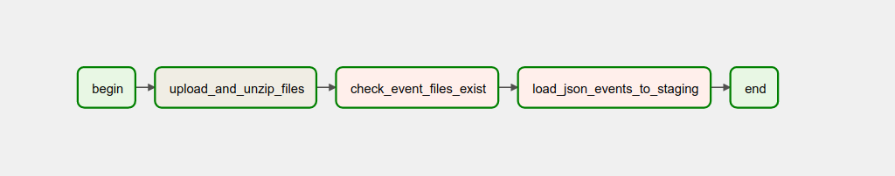
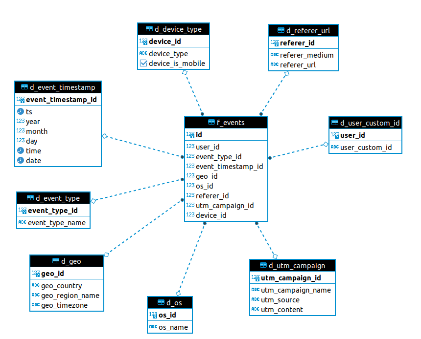

# de-02-workshop

# Source

**ASIS** Источником являются файлы вида `events-2022-Sep-30-2134.json.zip`. У ни есть какая-то частота появления (в проекте сделано допущение исходя из имени файла, частота появления файлов - день).
Например, файл `events-2022-Sep-30-2134.json.zip` - содержит информацию - за 30 сентября 2022 года, соответственно, файл с событиями за 1 октября будет иметь название:
- `events-2022-Oct-01-2134.json.zip`

Предположение: файлы не меняются

Перенос в `filesystem stg` осуществляется по наличию файла. Загружаемые файлы складываются в директорию `/src`

# STG

Структура `events_service`:
- `id`
- `filename` - имя загруженного файла
- `uploaded_at` - время загрузки в `stg` слой (UTC, сервер)
- `row_count` - кол-во загруженных строк

Таблица `json_events` (события внутри скачанного json):
- `id` - unique\pk
- `event_id`
- `event_timestamp` (допущение: в данных у поля нет указания timezone, **в проекте принято: event_timestamp передается в UTC**)
- `json_object`

Режим обновления\добавления: отслеживание изменеинй по полю `event_timestamp`

Для заполнения слоя STG реализован pipeline `Airflow`, схема представлена ниже:

# DDS
DWH реализовано согласно модели Snowflake, выбор сделан исходя из оптимальной сложности и гибкости, тк на текущий момент
бизнес не знает будет ли продолжать развитие.

Допущение: атрибуты сущностей не изменяются, CDC0.

Таблица `d_service`:
- `id`
- `last_id` (последний id из таблицы stg.json_events, который мы положили в DDS)
- 'table_name'
- `loaded_at`

Таблица фактов `f_events`:
- `id`
- `user_id`
- `event_type_id`
- `event_timestamp_id`
- `geo_id`
- `os_id`
- `referer_id`
- `utm_campaign_id`
- `device_id`

Справочники:
- `d_browser_name` (браузеры)
  - `browser_id`
  - `browser_name`
- `d_device_type` (девайсы)
  - `device_id`
  - `device_type`
  - `device_is_mobile`
- `d_geo` (координаты?):
  - `geo_id`
  - `geo_country`
  - `geo_region_name`
  - `geo_timezone`
- `d_os` (расшифровка ОС?):
  - `os_id`
  - `os_name`
- `d_page_url`:
- `url_id`
  - `page_url`
  - `page_url_path`
- `d_event_type` (формируется из page_url_path, для продуктов = `product`):
  - 'event_type_id'
  - 'event_type_name'
- `d_referer_url`:
  - `referer_id`
  - `referer_medium`
  - `referer_url`
- `d_users`:
  - `user_id`
  - `user_custom_id`
  - `user_domain_id`
- `d_utm`:
  - `utm_id`
  - `utm_campaign`
  - `utm_content`

Структура хранилища показана на рисунке ниже:

# CDM

Витрины:
1. распределение событий по часам;
2. количество купленных товаров в разрезе часа;
3. топ-10 посещённых страниц, с которых был переход в покупку — список ссылок с количеством покупок.

